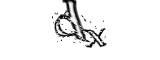

# KCAPTCHA Generator

[KCAPTCHA](http://www.captcha.ru/en/kcaptcha/) Generator

__Sample Images__




## Prerequisite

- php, php-gd
- python3

### Ubuntu

```sh
sudo apt-get install php7.2-cli php-gd
pip install -r requirements.txt
```

### Windows

```sh
choco install php --version=7.2.18 -y
# uncomment ;extension=gd2 in php.ini
pip install -r requirements.txt
```

## Usage

```
usage: generate.py [-h] [-s DATASET_SIZE] [-d DATASET_DIR] [-r TRAIN_TEST_RATIO] [-n NUM_DIGITS] [--chars CHARS] [-c]
                   [--no-split-validation] [-p] [--use-existing-server]

optional arguments:
  -h, --help            show this help message and exit
  -s DATASET_SIZE, --dataset-size DATASET_SIZE
                        Dataset size (Default: 10000)
  -d DATASET_DIR, --dataset-dir DATASET_DIR
                        Directory where dataset will be saved (Default: .data)
  -r TRAIN_TEST_RATIO, --train-test-ratio TRAIN_TEST_RATIO
                        Train/Test set ratio (Default: 0.8)
  -n NUM_DIGITS, --num-digits NUM_DIGITS
                        Number of CAPTCHA digits (Default: 2)
  --chars CHARS         Character set in CAPTCHA (Default: 0123456789)
  -c, --clear           Remove previous datasets before generation (Default: False)
  --no-split-validation
                        Do not split train/validation set with different directories (Default: False)
  -p, --preprocess      Do preprocess before saving image (Default: False)
  --use-existing-server
                        Do not open new php kcaptcha server, use pre-existing process
```

### Basic Usage

```sh
python generate.py
```

### Examples

```sh
# Generate 1000 CAPTCHA images of length 6 containing alphabet
python generate.py -s 1000 -n 6 --chars abcdefghijklmnopqrstuvwxyz
```

## Download existing dataset

See 